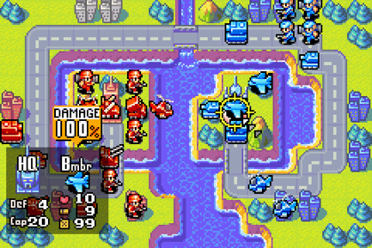

## Aufgabenstellung

Ihr seid ein 4-5-köpfiges Entwicklerteam, welches ein Advance-Wars-ähnliches Spiel in Form einer JavaFX-Anwendung
entwickeln soll. Bei _Advance Wars_ handelt es sich um ein rundenbasiertes Strategiespiel, welches 2001 für den GameBoy
Advance erschien und bei dem der Spieler das Kommando über verschiedene militärische Einheiten besitzt. Ziel des Spiels
ist dabei meist die Vernichtung aller gegnerischen Einheiten bzw. die Besetzung des gegnerischen Hauptquartiers. Das
Spiel bietet dabei sowohl einen Single- als auch einen Multiplayer-Modus. Da es sich um Advance-Wars-ähnliches Spiel
handeln soll, kann das Setting verändert werden (z.B. Fantasy oder Science-Fiction statt Military).

## Punktevergabe und Abgabe

Für die Umsetzung aller funktionaler Anforderungen werden maximal 34 Punkte vergeben und für die Nichteinhaltung
nichtfunktionaler Anforderungen werden maximal 17 Punkte abgezogen. Die Abgabe des Programmentwurfs erfolgt über
Moodle in Form einer ZIP-Datei, die alle relevanten Dateien (Quellcode-Dateien, FXML-Dateien, Grafiken etc.) beinhalten
muss. Letztmöglicher Abgabetermin ist **Sonntag, der 14.07.2024**.

## Funktionale Anforderungen

Die JavaFX-Anwendung soll alle Regeln des 2001 erschienen Spiels _Advance Wars_ für den GameBoy Advance umsetzen
(siehe [Spieleanleitung](manual.pdf)).

## Nichtfunktionale Anforderungen

- Der Einsatz externer Bibliotheken oder Frameworks ist nicht gestattet
- Die Anwendung soll einfach und intuitiv zu bedienen sein
- Die Anwendung soll leicht wart-, änder- und erweiterbar sein
- Die Anwendung soll stabil und zuverlässig sein
- Die Entwicklungssprache der Anwendung soll Englisch sein
- Die Darstellungsprache der Anwendung kann Deutsch oder Englisch sein

## Vereinfachungen

- Es müssen keine Optionen implementiert werden
- Es müssen keine Soundeffekte, Musik oder Animationen implementiert werden
- Es müssen keine Wettereffekte implementiert werden
- Es muss nur der Modus Spieler-gegen-Spieler implementiert werden
- Das einzige Spielziel soll die Vernichtung aller Einheiten des gegnerischen Spielers sein
- Jeder Spieler soll mit vorgegebenen Einheiten pro Karte starten, die auf vorgegebenen Positionen der Karte platziert
  sein sollen
- Es müssen nur die Karten [_Little Island_](https://www.warsworldnews.com/wp/aw/maps-aw/01-little-island/),
  [_Eon Springs_](https://www.warsworldnews.com/wp/aw/maps-aw/05-eon-springs/) und
  [_Piston Dam_](https://www.warsworldnews.com/wp/aw/maps-aw/17-piston-dam/) implementiert werden
- Es muss kein Nebel des Krieges implementiert werden
- Es müssen keine Kommandanten und Spezialfähigkeiten implementiert werden
- Es müssen keine Gebäude implementiert werden
- Es müssen nur die Landeinheiten [_Infantry_](https://www.warsworldnews.com/wp/aw/unit-aw/infantry/),
  [_Mechanized Infantry_](https://www.warsworldnews.com/wp/aw/unit-aw/mech/),
  [_Tank_](https://www.warsworldnews.com/wp/aw/unit-aw/tank/),
  [_Mobile Artillery_](https://www.warsworldnews.com/wp/aw/unit-aw/artillery/) und
  [_Anti-Air_](https://www.warsworldnews.com/wp/aw/unit-aw/anti-air/) implementiert werden
- Es müssen keine Wassereinheiten implementiert werden
- Es müssen nur die Flugeinheiten [_Fighter_](https://www.warsworldnews.com/wp/aw/unit-aw/fighter/),
  [_Bomber_](https://www.warsworldnews.com/wp/aw/unit-aw/bomber/) und
  [_Battle Copter_](https://www.warsworldnews.com/wp/aw/unit-aw/b-copter/) implementiert werden
- Kraftstoff und Munition müssen nicht implementiert werden
- Es müssen nur die Geländetypen _Plain_, _Wood_, _Mountain_ und _Sea_ implementiert werden
- Der Quellcode muss nicht dokumentiert werden
